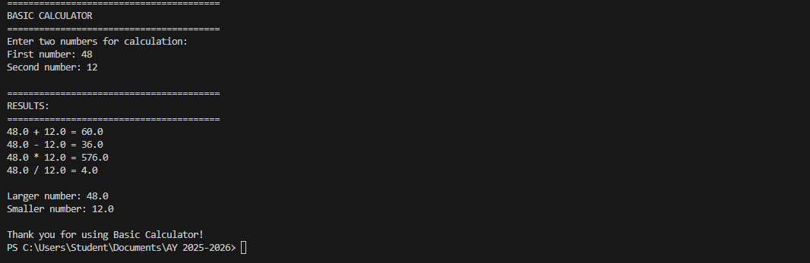
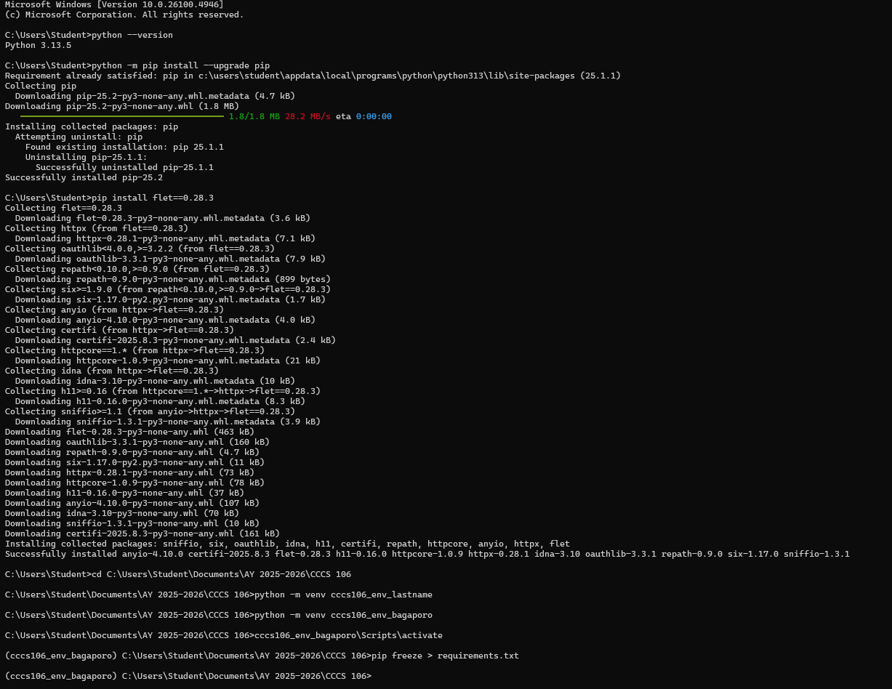
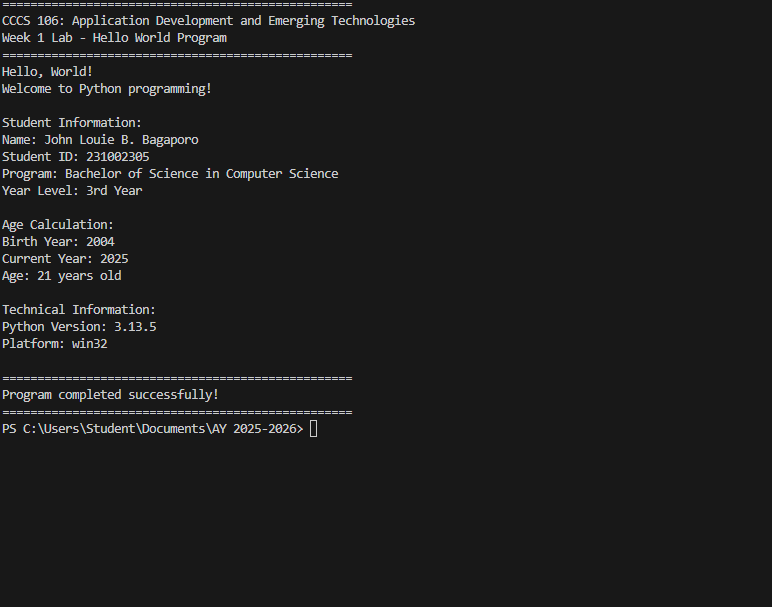
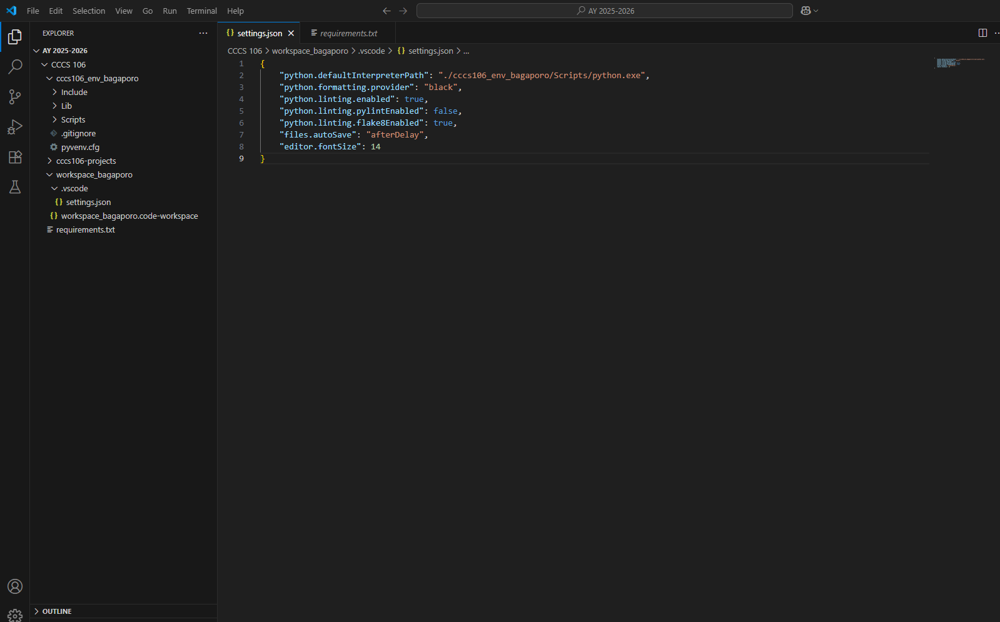

# Lab 1 Report: Environment Setup and Python Basics

**Student Name:** John Louie B. Bagaporo

**Student ID:** 231002305

**Section:** 3A

**Date:** August 27, 2025

## Environment Setup

### Python Installation
- **Python Version:** 3.13.5
- **Installation Issues:** The installation progressed as long as the instructions were followed.
- **Virtual Environment Created:** ✅ cccs106_env_bagaporo

### VS Code Configuration
- **VS Code Version:** 1.103.2
- **Python Extension:** ✅ Installed and configured
- **Interpreter:** ✅ Set to cccs106_env_bagaporo/Scripts/python.exe

### Package Installation
- **Flet Version:** 0.28.3
- **Other Packages:** requirements.txt

## Programs Created

### 1. hello_world.py
- **Status:** ✅ Completed
- **Features:** Student info display, age calculation, system info
- **Notes:** Student gender is not applied, as well as the student's birthday and month.

### 2. basic_calculator.py
- **Status:** ✅ Completed
- **Features:** Basic arithmetic, error handling, min/max calculation
- **Notes:** Can only perform basic arithmetics.

## Challenges and Solutions

The progress at the start began in a rough manner, but with the guidance of a friend, the pace progression paved smoothly after.

## Learning Outcomes

By following the instructions given in the activity, I learned that the file organization is cleaner and proper, and if a step was not followed, the process is disturbed and will require to start over from the part before that specific step.

## Screenshots

